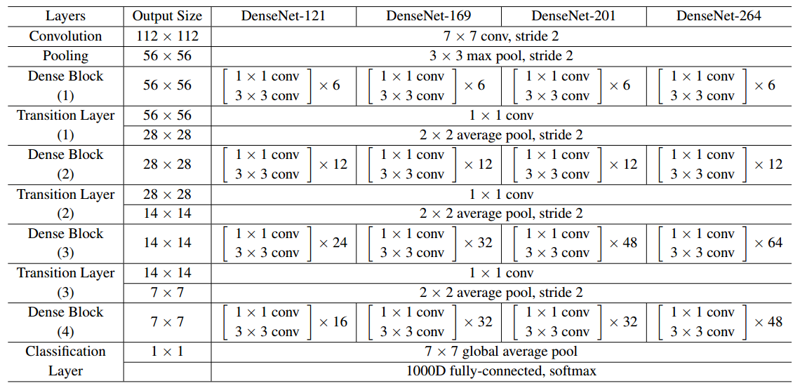

## 项目简介

本项目基于paddle 动态图实现了图像分类模型DenseNet ，建议使用GPU来运行本项目，静态图版本请查看：[基于PaddlePaddle的图像分类-DenseNet](https://aistudio.baidu.com/aistudio/projectDetail/205040)，具体介绍如下：

## DenseNet

相比ResNet，DenseNet提出了一个更激进的密集连接机制：即互相连接所有的层，具体来说就是每个层都会接受其前面所有层作为其额外的输入。图1为DenseNet的密集连接机制。
可以看到，在DenseNet中，每个层都会与前面所有层在channel维度上连接（concat）在一起（这里各个层的特征图大小是相同的，后面会有说明），并作为下一层的输入。
对于一个L层的网络，DenseNet共包含L(L+1)/2个连接，相比ResNet，这是一种密集连接。而且DenseNet是直接concat来自不同层的特征图，这可以实现特征重用，提升效率，这一特点是DenseNet与ResNet最主要的区别,具体结构如图所示。

**结构对比(CNN, ResNet, DenseNet)：** 

## DenseNet结构图

DenseNet核心思想在于建立了不同层之间的连接关系，充分利用了feature，进一步减轻了梯度消失问题，加深网络不是问题，而且训练效果非常好。
